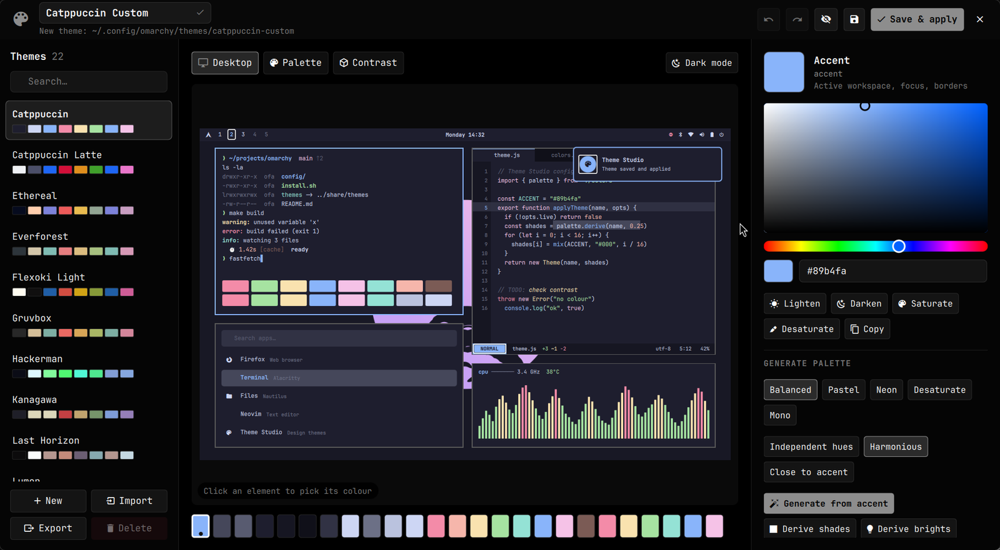

# Theme Studio for Omarchy

Design your own [Omarchy](https://omarchy.org) theme on a live desktop canvas.
Edit every colour, generate palettes, pick wallpapers, preview the result on
your real desktop, then save, apply, import or export it.

[Türkçe README](README.tr.md)



## Features

- **Desktop canvas.** A mock Omarchy desktop (bar, terminal, editor, launcher,
  system monitor, notification, window borders) painted only from the palette
  you are editing. Click any element to select the colour that paints it.
- **Palette view** with all 25 `colors.toml` colours, and a **contrast view**
  with WCAG ratios (AA/AAA) and a one-click *Fix*.
- **Colour picker:** HSV square, hue strip, hex field, lighten/darken/saturate.
- **Palette generator:** build a full palette from the accent (Balanced, Pastel,
  Neon, Desaturate, Mono), derive shades and bright colours, randomise, flip
  dark ⇄ light, or extract a palette from the wallpaper.
- **Window borders:** solid or gradient `hyprland_active_border`, with angle.
- **Wallpapers and icon theme** per theme.
- **Live preview:** pushes the palette to the running shell using Omarchy's own
  template engine. Closing without applying restores your current theme.
- **Undo / redo** and unsaved-change warnings.
- **Save** to `~/.config/omarchy/themes/<name>/` (`colors.toml`, `icons.theme`,
  `backgrounds/`, and a `preview.png` rendered from the canvas).
- **Apply** with `omarchy-theme-set`.
- **Export** to `~/Downloads/omarchy-<name>-theme.tar.gz`.
- **Import** a `.tar.gz`/`.zip`, a theme folder, a `colors.toml`, an
  `alacritty.toml`, or a git URL. An in-app file browser is included.
- English and Turkish UI (picked from `LANG`; override with `THEME_STUDIO_LANG`).

## Requirements

- Omarchy with the Quickshell-based `omarchy-shell` and its plugin system.
- `python3` 3.9 or newer (standard library only).
- Optional: ImageMagick (palette from wallpaper), `git` (import from URL),
  `wl-clipboard` (copy to clipboard). All ship with Omarchy.

## Install

```bash
omarchy plugin add https://github.com/ofa14-prog/omarchy-theme-studio.git --enable
```

Or by hand:

```bash
git clone https://github.com/ofa14-prog/omarchy-theme-studio.git \
  ~/.config/omarchy/plugins/io.github.ofa14-prog.theme-studio
omarchy-shell shell rescanPlugins
omarchy plugin enable io.github.ofa14-prog.theme-studio
```

## Uninstall

```bash
omarchy plugin remove io.github.ofa14-prog.theme-studio
```

If you added the menu entry or key binding below, delete those lines too.
Themes you created stay in `~/.config/omarchy/themes/`; remove them with
`omarchy theme remove <name>` or by deleting their folders. Theme Studio
changes nothing else on your system.

## Open it

```bash
omarchy-shell shell toggle io.github.ofa14-prog.theme-studio '{}'
# open a specific theme
omarchy-shell shell toggle io.github.ofa14-prog.theme-studio '{"theme":"catppuccin"}'
# open the import dialog prefilled
omarchy-shell shell toggle io.github.ofa14-prog.theme-studio '{"import":"~/Downloads/foo.tar.gz"}'
```

To add it to the Omarchy menu (**Style → Theme Studio**), add this line to
`~/.config/omarchy/extensions/omarchy-menu.jsonc`:

```jsonc
"style.theme-studio": {"icon":"󰏘","label":"Theme Studio","action":"omarchy-shell shell toggle io.github.ofa14-prog.theme-studio '{}'"},
```

To bind a key, add this to `~/.config/hypr/bindings.lua` (check the key is free
with `omarchy menu keybindings --print`):

```lua
o.bind("SUPER + ALT + T", "Theme Studio", "omarchy-shell shell toggle io.github.ofa14-prog.theme-studio '{}'")
```

## Keyboard

| Key | Action |
|---|---|
| `Ctrl+S` / `Ctrl+Shift+S` | Save / Save & apply |
| `Ctrl+Z` / `Ctrl+Y` | Undo / Redo |
| `Ctrl+N` | New theme |
| `Ctrl+I` / `Ctrl+E` | Import / Export |
| `Ctrl+P` | Toggle live preview |
| `1` `2` `3` | Desktop / Palette / Contrast |
| `Esc` | Close dialog or Theme Studio |

## Safety

- Theme Studio only writes inside `~/.config/omarchy/themes/` and the export
  folder you choose. Deleting is limited to your own themes and never the
  active one.
- Imports follow the same rule as `omarchy-theme-set` for themes from git:
  `.lua` files, terminal configs (`alacritty.toml`, `kitty.conf`, `ghostty.conf`,
  `foot.ini`) and `vscode.json` are skipped unless you tick *I trust this
  source*. Symlinks are never followed, archives are checked for path
  traversal and limited to 512 MB / 2000 files.
- Every value written to `colors.toml` is validated (hex colours, `dark`/`light`,
  border gradients), so nothing can break out of the generated Lua/CSS configs.
- Git imports only accept `https://`, `ssh://` and `git@` URLs, never prompt for
  credentials and do not fetch submodules.

## Command line

All file work goes through `bin/theme-studio`, which prints JSON and can be
used on its own:

```bash
python3 bin/theme-studio list
python3 bin/theme-studio export my-theme ~/Desktop
python3 bin/theme-studio import ~/Downloads/omarchy-foo-theme.tar.gz
python3 bin/theme-studio apply my-theme
python3 bin/theme-studio doctor
```

## Development

```bash
python3 -m unittest discover -s tests   # helper, against a fake HOME/OMARCHY_PATH
node tests/palette.test.mjs             # colour maths and i18n
python3 tests/check_i18n.py             # every UI string is translated
```

| File | Purpose |
|---|---|
| `ThemeStudio.qml` | Overlay: library, canvas, inspector, dialogs |
| `components/DesktopCanvas.qml` | Mock desktop painted from the palette |
| `components/ColorPicker.qml` | HSV colour picker |
| `components/FileBrowser.qml` | In-app file browser |
| `Palette.js` | Colour maths, palette generation, contrast |
| `I18n.js` | Translations (add a language by adding a table) |
| `bin/theme-studio` | List, load, save, preview, import, export, apply |

Translations are welcome: add a table to `I18n.js` and run
`python3 tests/check_i18n.py`.

## License

[MIT](LICENSE)
